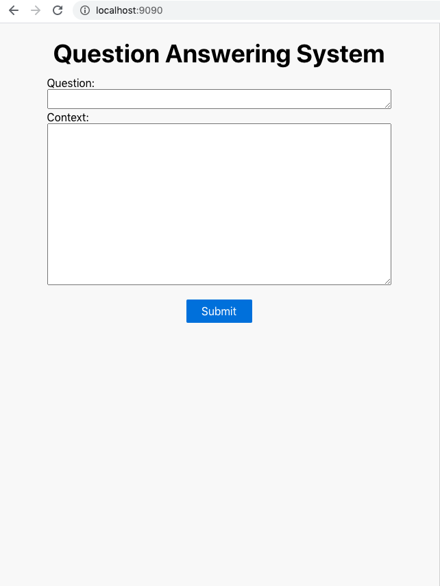
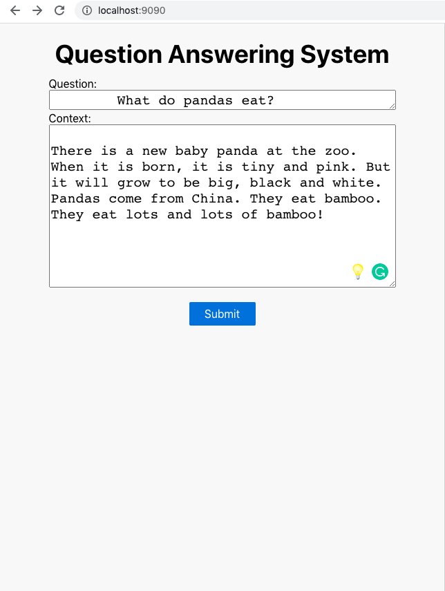
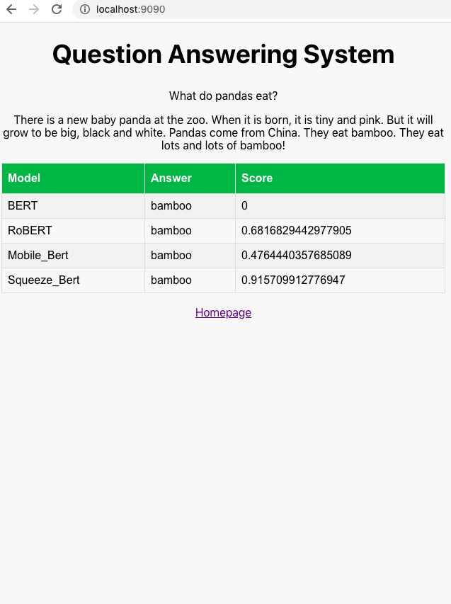

# Question_Answering_SQUAD
This repository contains implementation of pretrained bert model and its varients on SQuAD Dataset. The docker image is uploaded on DockerHub. You can find the image [here](https://hub.docker.com/repository/docker/dharnashukla94/qa_squad/) or you can run the following cmd with docker installed:

```shell
$ docker pull dharnashukla94/qa_squad
```

## Getting Started in 10 Minutes

- Clone this repo 
- Install requirements
- Run the script
- Go to http://localhost:9090
- Done!

    


## Run with Docker

With **[Docker](https://www.docker.com)**, you can quickly build and run the entire application in minutes

```shell
# 1. First, clone the repo
$ git clone https://github.com/dharnashukla94/Question_Answering_SQUAD.git
$ cd Question_Answering_SQUAD

# 2. Build Docker image
$ docker build -t qa_squad .

# 3. Run!
$ docker run -p 9090:9090 qa_squad
```

Open http://localhost:9090 and wait till the webpage is loaded.

## Local Installation

It's easy to install and run it on your computer.

```shell
# 1. First, clone the repo
$ git clone https://github.com/Question_Answering_SQUADr.git
$ cd Question_Answering_SQUAD

# 2. Install Python packages
$ pip install -r requirements.txt

# 3. Run!
$ python main.py
```

Open http://localhost:9090 and wait till the webpage is loaded.

 
